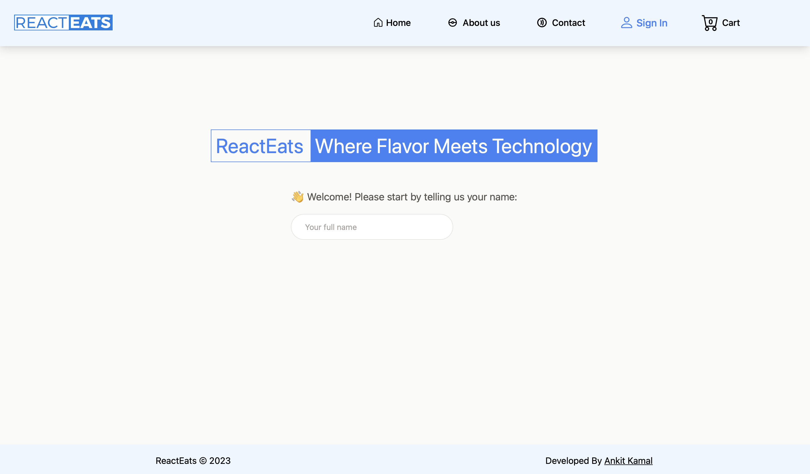
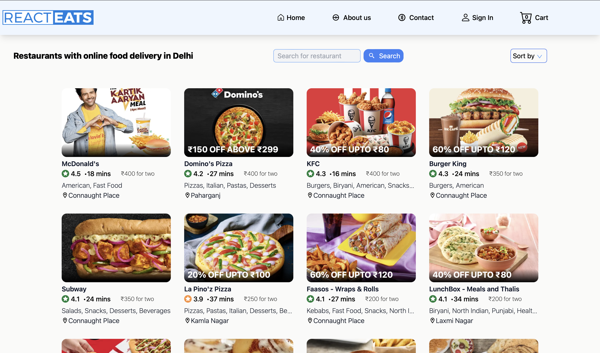
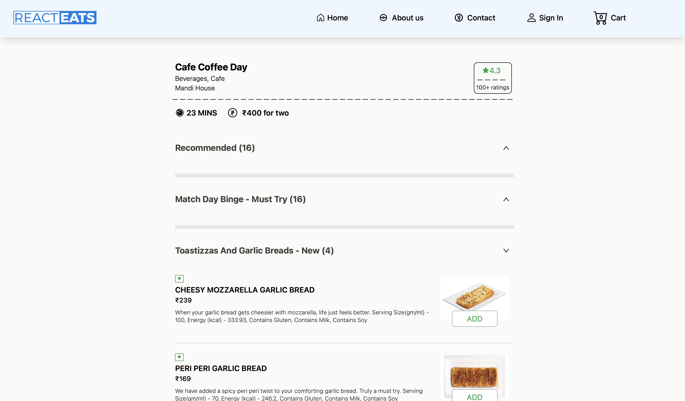
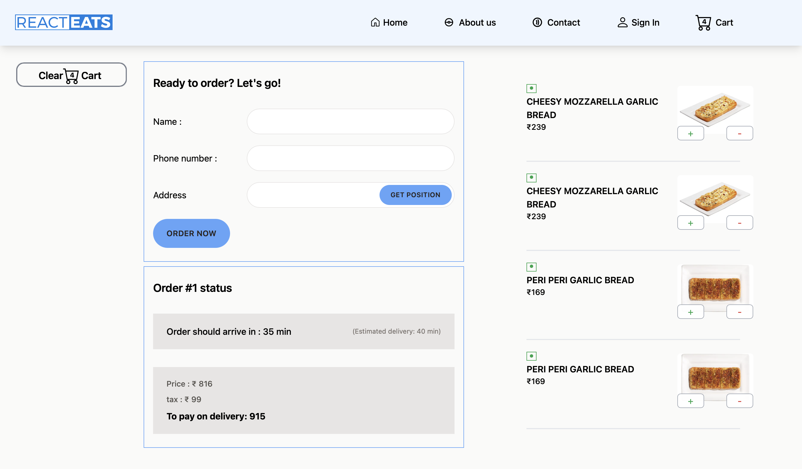

## ReactEats - Food Delivering Webapp

### Deployment on vercel: https://react-eats.vercel.app/

### Technologies Used

- Front-end:
  `React`
  `Redux`
  `Tailwind CSS`
  `JavaScript`
  `React Router`

- API Integration : `Swiggy API`

### Screenshot

- Sign In Page.
  

- Browse Page with Restaurant data fetched from the integration of the Swiggy API
  

- Restaurant items fetched from Swiggy API with dynamic routing
- react-eats.vercel.app/restaurants/:resid
  

- Cart Details
  

---

## Setup the project

1. Fork the project
2. Clone project
3. Install dependencies `npm install`
4. To run the server execute `npm start`

---

## Backend server for ReactEats

- https://github.com/ankittkamal/ReactEats-backend

#### Old version of this project

- https://github.com/ankittkamal/Food-Explorer
